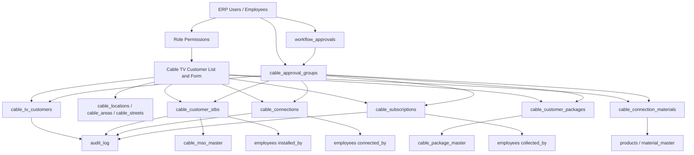
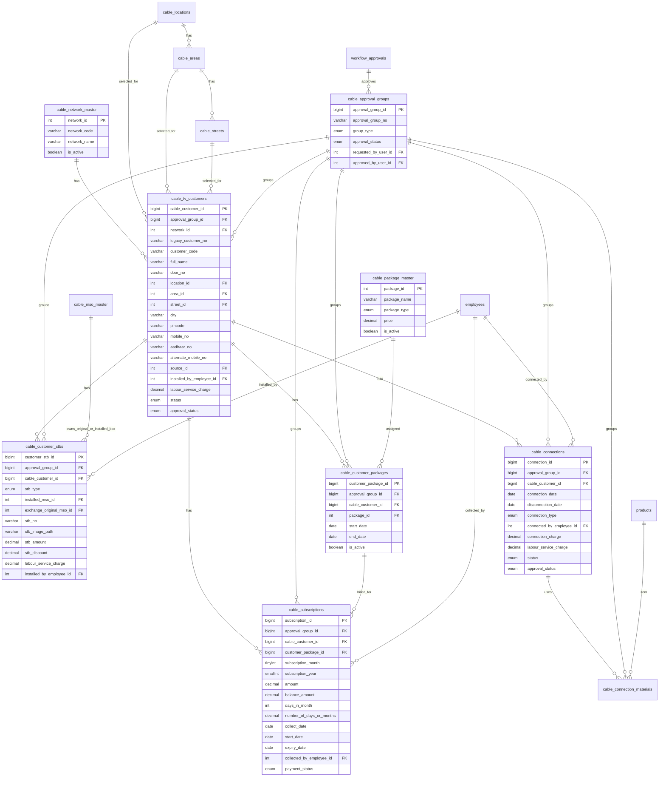

# Cable TV Customer Module - Database Architecture

**Project:** TCV Core  
**Module:** Cable TV Customer Management  
**Prepared Date:** 2026-07-01  
**Status:** Reviewed with updated Cable TV workflow points  

---

## 1. Module Description

The Cable TV module will manage customer onboarding, set-top box details, connection history, package assignment, material usage, and monthly subscription collection for the cable TV business.

This module is different from the existing general ERP customer flow because it needs cable-specific customer numbers, network ownership, STB tracking, connection lifecycle, monthly package billing, and subscription collection by field users.

The current ERP already has users, employees, permissions, products, stock, work orders, and customer tables. This document proposes a cable-specific structure that can integrate with those existing masters while keeping Cable TV data clean and searchable.

---

## 2. Main Business Requirements

### Customer List

- Show all Cable TV customers in a single list.
- Provide an **Add New Customer** button at the top.
- All list columns must support filter/search.
- Each customer row must have an action menu:
  - Connection Details + Material Details (combine together)
  - STB Details
  - Package Details
  - Subscription Details

### Add New Customer Form

The form must capture:

- Customer full name
- Door number
- Location, area, street, city, pincode
- Area and street dependency: after selecting an area, only streets mapped to that area must be listed
- Mobile number
- Aadhaar number
- Alternate mobile number
- Type of network: TCV, PAMMAL, MURUGAN, SVN
- Source of connection 
- Installed by (if not admin, capture from user name - from logged in data)
- Labour/service charge

The following sections contain detailed data capture requirements:
- STB details 
    Stb type : new / Fault /Replaced, exchange, customer owned
    Exchange of : if stb type is exchange – need to track the original stb mso name 
    Example (we are giving vk , customer have jak, we collect jak box and install vk box)
    Stb number
    Stb amount,
    stb_image,
    Stb discount
    Labour/service charge
    Installed by

- Connection details + Used material details(combine)
    Connection date
    Disnection date
    Type connection : new / shifted / transferred
    Connectedby
    Connection charge
    Used material details – which from add the list of items
        which will fetch from exiting product table in tcverp
        need to add the material list using add row concept
    Labour/service charge

- Package details
    Package name – lov fetch from backend (need to add the package in a table)
    Price – fetch value based on value
    Package type : mso package /addon / alacarte / broad cast

- Subscription details
    MONTH
    Year    
    Amount – amount will calculate based on package value, that is one month from 1 to last day of month
    Days of month : day/month
    balance - should calcuate
    Number of day/Month :
    Collect date – need to calculate the days or month from selected date
    startdate
    expirydate
    Collected by


### User and Admin Entry Rule

- A normal user can add customer data only with their own login employee/user identity.
- The installed-by/collected-by/connected-by field should be automatically captured from the login session for normal users.
- Admin users can choose the employee/person manually.
- Final access will be controlled from the existing Role Permissions administration screen.
- Data inserted by non-admin users must be routed through workflow approval before becoming active.
- Customer, STB, connection/material, package, and subscription modules should support approval where required.
- Only approved customers should appear in the default customer list. Pending records should remain in workflow/pending approval status until approved.

---

## 3. Legacy Customer Number Handling

Existing portal has separate customer number ranges:

| Network | Legacy Customer Number Range |
|---|---:|
| MURUGAN | 101 to 999 |
| PAMMAL | 101 to 999 |
| TCV | 1001 to 2000 and 6001 onward |
| SVN | 3001 to 6000 |

### Recommended Design

Do not create four separate customer tables in the new system. Use one combined table:

`cable_tv_customers`

Store:

- `network_type`
- `legacy_customer_no`
- generated `customer_code`

This allows all customers to be searched together while still preserving old network-wise numbering.

Recommended unique rule:

```sql
UNIQUE KEY uk_network_legacy_customer (network_type, legacy_customer_no)
```

This allows customer number `101` to exist once for MURUGAN and once for PAMMAL without conflict.

---

## 4. High-Level Architecture Diagram



---

## 5. Database Entity Relationship Diagram



---

## 6. Proposed Tables List

### A. Master Tables

| Table | Purpose |
|---|---|
| `cable_network_master` | Stores network names: TCV, PAMMAL, MURUGAN, SVN |
| `cable_locations` | Location master |
| `cable_areas` | Area master mapped to location |
| `cable_streets` | Street master mapped to area |
| `cable_connection_sources` | Source of connection master |
| `cable_mso_master` | MSO/operator master for STB tracking |
| `cable_package_master` | Package name, type, and price |
| `cable_approval_groups` | Groups onboarding/update records into workflow approval bundles |

### B. Customer and Transaction Tables

| Table | Purpose |
|---|---|
| `cable_tv_customers` | Main combined customer table for all networks |
| `cable_customer_stbs` | Customer STB details and exchange history |
| `cable_connections` | Connection, disconnection, shifted, transferred history |
| `cable_connection_materials` | Material/items used for a connection |
| `cable_customer_packages` | Package assigned to customer |
| `cable_subscriptions` | Monthly/yearly subscription billing and collection |

### C. Integration Tables Already Available

| Existing Table | Usage in Cable TV Module |
|---|---|
| `users` | Login identity and role |
| `employees` | Installed by, connected by, collected by |
| `role_permissions` | Add/view/update/delete permission control |
| `workflow_approvals` | Existing ERP workflow screen used to approve Cable TV approval groups |
| `products` | Material item selection when inventory product is used |
| `material_master` | Material catalog for cable work |
| `stock_master` | Available stock quantity |
| `stock_ledger` | Material/STB issue stock movement |
| `audit_log` | Audit trail for create/update/delete |

---

## 7. Table Details

### 7.1 `cable_network_master`

Stores the cable network/operator.

| Column | Type | Notes |
|---|---|---|
| `network_id` | INT PK | Auto increment |
| `network_code` | VARCHAR(20) | TCV, PAMMAL, MURUGAN, SVN |
| `network_name` | VARCHAR(100) | Display name |
| `customer_no_start` | INT | Optional range start |
| `customer_no_end` | INT | Optional range end |
| `is_active` | TINYINT | Active/inactive |
| `created_at` | TIMESTAMP | Created date |
| `updated_at` | TIMESTAMP | Updated date |

Initial records:

| network_code | network_name | Range |
|---|---|---|
| `TCV` | TCV | 1001-2000, 6001 onward |
| `PAMMAL` | Pammal | 101-999 |
| `MURUGAN` | Murugan | 101-999 |
| `SVN` | SVN | 3001-6000 |

### 7.2 `cable_locations`

| Column | Type | Notes |
|---|---|---|
| `location_id` | INT PK | Auto increment |
| `location_name` | VARCHAR(150) | Location name |
| `city` | VARCHAR(100) | City |
| `pincode` | VARCHAR(10) | Default pincode |
| `is_active` | TINYINT | Active/inactive |

### 7.3 `cable_areas`

| Column | Type | Notes |
|---|---|---|
| `area_id` | INT PK | Auto increment |
| `location_id` | INT FK | References `cable_locations` |
| `area_name` | VARCHAR(150) | Area name |
| `is_active` | TINYINT | Active/inactive |

Recommended unique key:

```sql
UNIQUE KEY uk_location_area (location_id, area_name)
```

### 7.4 `cable_streets`

| Column | Type | Notes |
|---|---|---|
| `street_id` | INT PK | Auto increment |
| `area_id` | INT FK | References `cable_areas` |
| `street_name` | VARCHAR(150) | Street name |
| `is_active` | TINYINT | Active/inactive |

Recommended unique key:

```sql
UNIQUE KEY uk_area_street (area_id, street_name)
```

### 7.5 `cable_connection_sources`

| Column | Type | Notes |
|---|---|---|
| `source_id` | INT PK | Auto increment |
| `source_name` | VARCHAR(100) | Direct, referral, field canvassing, phone call, etc. |
| `is_active` | TINYINT | Active/inactive |

### 7.6 `cable_mso_master`

Used to identify STB ownership/operator, especially for exchange cases.

| Column | Type | Notes |
|---|---|---|
| `mso_id` | INT PK | Auto increment |
| `mso_name` | VARCHAR(100) | Example: VK, JAK |
| `is_active` | TINYINT | Active/inactive |

### 7.7 `cable_package_master`

| Column | Type | Notes |
|---|---|---|
| `package_id` | INT PK | Auto increment |
| `package_name` | VARCHAR(150) | Package name LOV |
| `package_type` | ENUM | MSO_PACKAGE, ADDON, ALACARTE, BROADCAST |
| `price` | DECIMAL(12,2) | Auto fetched in package form |
| `is_active` | TINYINT | Active/inactive |

### 7.8 `cable_approval_groups`

Groups multiple Cable TV rows into one workflow approval request.

For new customer onboarding, one `approval_group_id` should be shared by:

- Customer details
- STB details
- Connection details
- Connection material rows
- Package details
- Subscription details

For later changes, create a separate approval group only for the changed module.

| Column | Type | Notes |
|---|---|---|
| `approval_group_id` | BIGINT PK | Auto increment |
| `approval_group_no` | VARCHAR(50) | Unique approval group number |
| `group_type` | ENUM | NEW_CUSTOMER_ONBOARDING, CUSTOMER_UPDATE, STB_UPDATE, CONNECTION_UPDATE, MATERIAL_UPDATE, PACKAGE_UPDATE, SUBSCRIPTION_UPDATE |
| `approval_status` | ENUM | PENDING, APPROVED, REJECTED |
| `requested_by_user_id` | INT FK | User who submitted the approval request |
| `approved_by_user_id` | INT FK | User who approved/rejected |
| `requested_at` | TIMESTAMP | Requested date/time |
| `approved_at` | TIMESTAMP NULL | Approval date/time |
| `rejected_reason` | TEXT NULL | Rejection reason |

### 7.9 `cable_tv_customers`

Main table for all Cable TV customers.

| Column | Type | Notes |
|---|---|---|
| `cable_customer_id` | BIGINT PK | Auto increment |
| `approval_group_id` | BIGINT NULL FK | Same group ID for complete new customer onboarding |
| `erp_customer_id` | INT NULL FK | Optional link to existing `customers.customer_id` |
| `network_id` | INT FK | TCV/PAMMAL/MURUGAN/SVN |
| `legacy_customer_no` | VARCHAR(50) | Old portal customer number |
| `customer_code` | VARCHAR(50) | New generated customer code |
| `full_name` | VARCHAR(150) | Customer full name |
| `door_no` | VARCHAR(50) | Door number |
| `location_id` | INT FK | Selected location |
| `area_id` | INT FK | Selected area |
| `street_id` | INT FK | Selected street |
| `city` | VARCHAR(100) | City |
| `pincode` | VARCHAR(10) | Pincode |
| `mobile_no` | VARCHAR(20) | Required |
| `aadhaar_no` | VARCHAR(12) | Aadhaar number |
| `alternate_mobile_no` | VARCHAR(20) | Alternate mobile |
| `source_id` | INT FK | Source of connection |
| `installed_by_employee_id` | INT FK | Captured from login for normal users |
| `labour_service_charge` | DECIMAL(12,2) | Customer-level service/labour charge |
| `status` | ENUM | ACTIVE, INACTIVE, DISCONNECTED, SHIFTED, TRANSFERRED |
| `approval_status` | ENUM | PENDING, APPROVED, REJECTED |
| `created_by_user_id` | INT FK | Login user |
| `approved_by_user_id` | INT NULL FK | Admin/approver user |
| `approved_at` | TIMESTAMP NULL | Approval date/time |
| `rejected_reason` | TEXT NULL | Reason when rejected |
| `created_at` | TIMESTAMP | Created date |
| `updated_at` | TIMESTAMP | Updated date |

Important indexes:

```sql
UNIQUE KEY uk_network_legacy_customer (network_id, legacy_customer_no);
UNIQUE KEY uk_customer_code (customer_code);
INDEX idx_mobile_no (mobile_no);
INDEX idx_location_area_street (location_id, area_id, street_id);
```

### 7.10 `cable_customer_stbs`

Stores current and historical STB records.

| Column | Type | Notes |
|---|---|---|
| `customer_stb_id` | BIGINT PK | Auto increment |
| `approval_group_id` | BIGINT NULL FK | Same onboarding group or separate STB update group |
| `cable_customer_id` | BIGINT FK | Customer |
| `stb_type` | ENUM | NEW, FAULT, REPLACED, EXCHANGE, CUSTOMER_OWNED |
| `installed_mso_id` | INT FK | MSO of installed box |
| `exchange_original_mso_id` | INT FK | Required if `stb_type = EXCHANGE` |
| `stb_no` | VARCHAR(100) | STB number |
| `stb_image_path` | VARCHAR(255) | Uploaded STB image path |
| `stb_amount` | DECIMAL(12,2) | STB amount |
| `stb_discount` | DECIMAL(12,2) | Discount |
| `labour_service_charge` | DECIMAL(12,2) | Labour/service charge |
| `installed_by_employee_id` | INT FK | Auto/user selected based on role |
| `installed_date` | DATE | Installation date |
| `status` | ENUM | ACTIVE, RETURNED, FAULTY, REPLACED |

Exchange example:

- Customer has JAK box.
- Company gives VK box.
- `installed_mso_id = VK`
- `exchange_original_mso_id = JAK`
- `stb_type = EXCHANGE`

### 7.11 `cable_connections`

| Column | Type | Notes |
|---|---|---|
| `connection_id` | BIGINT PK | Auto increment |
| `approval_group_id` | BIGINT NULL FK | Same onboarding group or separate connection update group |
| `cable_customer_id` | BIGINT FK | Customer |
| `connection_date` | DATE | Connection date |
| `disconnection_date` | DATE | Disconnection date |
| `connection_type` | ENUM | NEW, SHIFTED, TRANSFERRED |
| `connected_by_employee_id` | INT FK | Connected by |
| `connection_charge` | DECIMAL(12,2) | Connection charge |
| `labour_service_charge` | DECIMAL(12,2) | Labour/service charge |
| `status` | ENUM | ACTIVE, DISCONNECTED, SHIFTED, TRANSFERRED |
| `approval_status` | ENUM | PENDING, APPROVED, REJECTED |
| `remarks` | TEXT | Notes |

### 7.12 `cable_connection_materials`

Tracks materials used during connection. This can link to current inventory/product tables.

| Column | Type | Notes |
|---|---|---|
| `connection_material_id` | BIGINT PK | Auto increment |
| `approval_group_id` | BIGINT NULL FK | Same onboarding group or separate material update group |
| `connection_id` | BIGINT FK | Cable connection |
| `product_id` | INT FK NULL | Existing `products.product_id` |
| `material_id` | INT FK NULL | Existing `material_master.material_id` |
| `item_name` | VARCHAR(200) | Snapshot item name |
| `qty` | DECIMAL(10,2) | Used quantity |
| `unit` | VARCHAR(20) | PCS, MTR, etc. |
| `unit_rate` | DECIMAL(12,2) | Rate |
| `amount` | DECIMAL(12,2) | Qty x rate |
| `issued_by_employee_id` | INT FK | Issued by |

When a stock item is used, create a `stock_ledger` transaction with `transaction_type = INSTALLATION`.

### 7.13 `cable_customer_packages`

| Column | Type | Notes |
|---|---|---|
| `customer_package_id` | BIGINT PK | Auto increment |
| `approval_group_id` | BIGINT NULL FK | Same onboarding group or separate package update group |
| `cable_customer_id` | BIGINT FK | Customer |
| `package_id` | INT FK | Selected package |
| `package_price` | DECIMAL(12,2) | Snapshot price at assignment time |
| `start_date` | DATE | Package start date |
| `end_date` | DATE | Optional end date |
| `is_active` | TINYINT | Current active package |

### 7.14 `cable_subscriptions`

Stores monthly/yearly collection.

| Column | Type | Notes |
|---|---|---|
| `subscription_id` | BIGINT PK | Auto increment |
| `approval_group_id` | BIGINT NULL FK | Same onboarding group or separate subscription update group |
| `cable_customer_id` | BIGINT FK | Customer |
| `customer_package_id` | BIGINT FK | Customer package |
| `subscription_month` | TINYINT | 1 to 12 |
| `subscription_year` | SMALLINT | Example: 2026 |
| `days_in_month` | INT | 28, 29, 30, or 31 |
| `billing_basis` | ENUM | MONTH, DAY |
| `number_of_days_or_months` | DECIMAL(8,2) | Billing quantity |
| `amount` | DECIMAL(12,2) | Calculated amount |
| `paid_amount` | DECIMAL(12,2) | Amount collected |
| `balance_amount` | DECIMAL(12,2) | Amount - paid amount |
| `collect_date` | DATE | Collection date |
| `start_date` | DATE | Subscription period start date |
| `expiry_date` | DATE | Subscription period expiry date |
| `collected_by_employee_id` | INT FK | Captured from login/user-selected by admin |
| `payment_mode` | ENUM | CASH, UPI, CARD, BANK, CHEQUE |
| `payment_status` | ENUM | PENDING, PARTIAL, PAID, CANCELLED |
| `remarks` | TEXT | Notes |

Recommended unique key:

```sql
UNIQUE KEY uk_customer_package_month (cable_customer_id, customer_package_id, subscription_month, subscription_year)
```

---

## 8. Subscription Amount Calculation

Package price is fetched from `cable_package_master.price`.

For a full month:

```text
amount = package_price
```

For day-based calculation:

```text
days_in_month = last_day_of_selected_month
per_day_price = package_price / days_in_month
amount = per_day_price * number_of_days
```

Example:

```text
Package price: 300
Month: July 2026
Days in month: 31
Selected days: 10
Amount = 300 / 31 * 10 = 96.77
```

---

## 9. Recommended API Modules

| API Module | Purpose |
|---|---|
| `/api/cable-customers` | Customer list/add/edit/view |
| `/api/cable-locations` | Location, area, street LOV |
| `/api/cable-networks` | Network LOV |
| `/api/cable-stbs` | Customer STB add/history |
| `/api/cable-connections` | Connection lifecycle |
| `/api/cable-packages` | Package master and customer package assignment |
| `/api/cable-subscriptions` | Monthly subscription billing and collection |
| `/api/cable-materials` | Material usage for connection |

Recommended permission key:

```text
CABLE_TV_CUSTOMERS
CABLE_TV_STB
CABLE_TV_CONNECTIONS
CABLE_TV_PACKAGES
CABLE_TV_SUBSCRIPTIONS
CABLE_TV_MATERIALS
```

---

## 10. UI Screen Structure

### Cable TV Customer List

Columns:

- Network
- Customer No
- Customer Name
- Door No
- Location
- Area
- Street
- City
- Pincode
- Mobile No
- Aadhaar No
- Alternate Mobile
- Source
- Installed By
- Status
- Created Date
- Action

Actions:

- Connection Details + Material Details
- STB Details
- Package Details
- Subscription Details
- Edit Customer

### Add New Customer Screen

Recommended tabs/sections:

1. Customer Details
2. STB Details
3. Connection Details + Material Details
4. Package Details
5. Subscription Details

For first implementation, all sections can be on one form if business wants single-entry flow. Later, each action menu can open the detailed history screen.

---

## 11. Data Migration Plan

When old customer tables are uploaded:

1. Load each old portal table into staging tables:
   - `stg_murugan_customers`
   - `stg_pammal_customers`
   - `stg_tcv_customers`
   - `stg_svn_customers`
2. Clean phone, Aadhaar, address, area, street, and pincode values.
3. Create missing location/area/street master records.
4. Insert into `cable_tv_customers`.
5. Preserve old number in `legacy_customer_no`.
6. Map each customer to `network_id`.
7. Create initial STB/package/subscription records if old data contains those details.

---

## 12. Implementation Notes

- Use one combined cable customer table for all networks.
- Keep legacy customer number with network-wise unique key.
- Do not allow normal users to manually change installed-by, connected-by, or collected-by values.
- Admin can override employee selection.
- Area/street LOV must come from backend:
  - Select location
  - Load areas for location
  - Select area
  - Load streets for area
- Package price must be copied into customer package/subscription as a snapshot to preserve historical billing.
- STB exchange must store both installed MSO and original collected MSO.
- STB records must support image upload using `stb_image_path`.
- Connection and material entry should be combined in one screen because material usage belongs to a connection.
- Material usage should update stock ledger when linked to stock products.
- Non-admin-created records must enter `PENDING` approval state and should be routed to the workflow approval screen.
- A new customer submission should create one `NEW_CUSTOMER_ONBOARDING` approval group covering customer, STB, connection, connection materials, package, and subscription rows.
- Later updates should create a separate approval group for only the updated detail module.
- Active customer list should show only approved customers by default. Pending records should be visible in workflow/pending approval screens.
- Subscription records should store start date, expiry date, paid amount, and balance amount.
- All create/update/delete operations should write to audit log.

---

## 13. Final Recommended Table Count

New Cable TV-specific tables:

| Group | Count |
|---|---:|
| Master tables | 7 |
| Workflow grouping tables | 1 |
| Customer/transaction tables | 6 |
| Total new tables | 14 |

Existing ERP tables reused:

| Group | Count |
|---|---:|
| Users/employees/permissions/audit | 4 |
| Inventory/material/stock | 4 |
| Total reused tables | 8 |

Overall Cable TV module touches around **22 tables**, with **14 new module-specific tables**.

---

## 14. Review Points and Updated Decisions

The following points were reviewed after the latest business updates.

| Review Point | Updated Decision |
|---|---|
| Customer action menu | Combine **Connection Details** and **Material Details** because used materials are part of the connection activity. |
| STB image | Add `stb_image_path` in `cable_customer_stbs` to store uploaded STB image/file path. |
| Material source | Used material rows should fetch items from the existing TCV ERP `products` table, with optional `material_master` mapping. |
| Material entry method | Use add-row style entry under the connection screen. Each row captures item, quantity, unit, rate, and amount. |
| Non-admin data entry | User-created records must be saved as `PENDING` and sent to workflow approval. |
| Admin data entry | Admin can directly approve or create as approved, depending on permission setup. |
| Customer list visibility | Default customer list should show only `APPROVED` customers. Pending customers should be shown in workflow/pending approval screens. |
| Installed/connected/collected by fields | For normal users, capture from logged-in user/employee and make non-editable. For admin, allow employee selection. |
| Subscription balance | Add `paid_amount` and `balance_amount` to subscription records. Balance should calculate as `amount - paid_amount`. |
| Subscription period | Add `start_date` and `expiry_date` to subscription records. These dates should be calculated from collect date, month/year, and billing basis where possible. |
| Workflow coverage | Customer, STB, connection/material, package, and subscription changes should support approval workflow when entered by non-admin users. |
| New customer approval grouping | Initial customer, STB, connection, material, package, and subscription rows must share one `approval_group_id` and be approved together. |
| Separate update approval | After the customer is approved, each later detail update should create its own approval group and should not block unrelated approved details. |

### Pending Clarifications Before SQL Implementation

| Question | Recommendation |
|---|---|
| Should admin-created records skip workflow automatically? | Recommended: yes, if admin has create/approve permission. |
| Should every update require approval or only new customer creation? | Recommended: require approval for customer, STB, connection, package, and subscription changes created by non-admin users. |
| Should rejected records be editable and resubmitted? | Recommended: yes, keep `REJECTED` status with reason and allow resubmission as `PENDING`. |
| Should subscription support partial payment? | Recommended: yes, because `balance_amount` is now required. |
| Should STB image be mandatory? | Recommended: optional in database, configurable as mandatory in frontend validation if business requires it later. |
